# Maps

All map images are built by running

```
make gather
```

and can be found in the `res` directory.

## World map

The world map is shown to consist of 39*4 x 39*4 tiles (can be seen in the pencil drawing of the map available on the web). The
data seems to be stored in `DDD1/ddd.mapa` and can be plotted with

```
./src/map2png.py c64/DDD1/ddd.mapa 52
```

It looks like the map file contains a `52 x 52*2` data set (52*3 == 39*4).

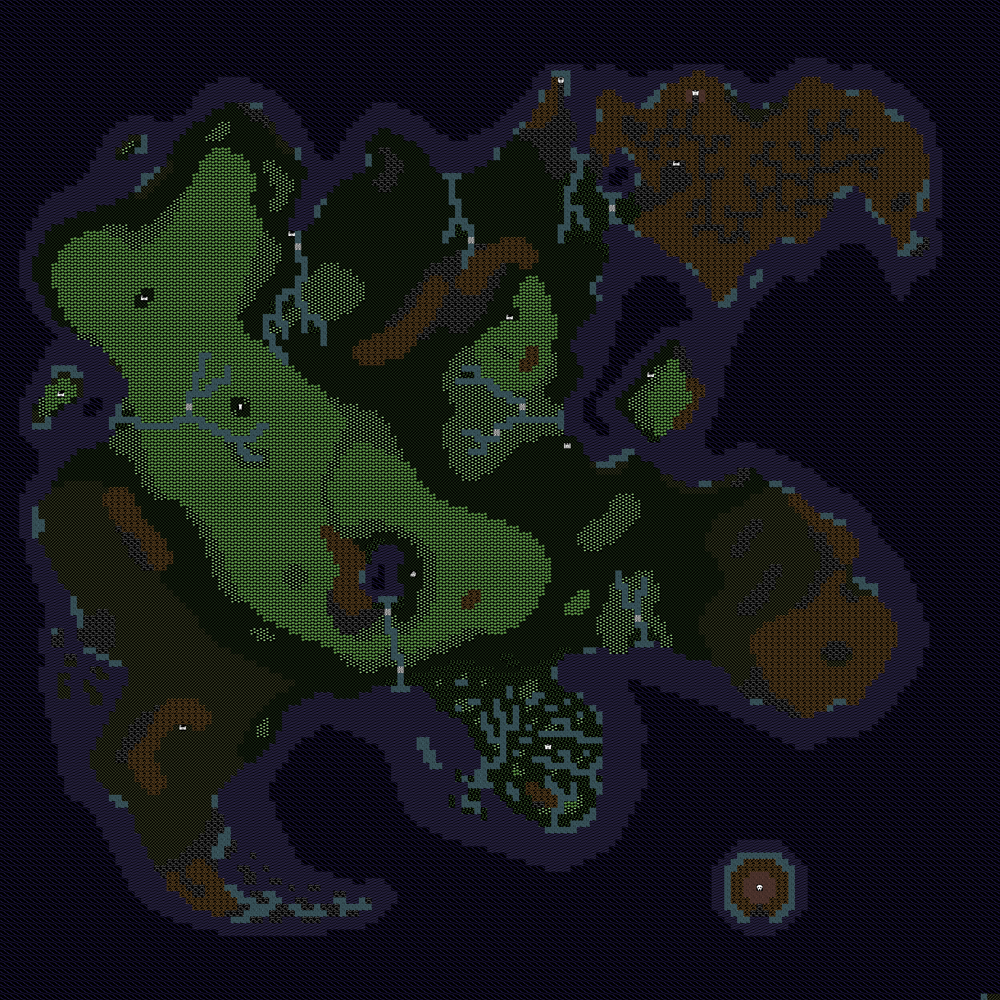

## Submaps

Most submaps of towns and castles are 35 tiles wide.

```
./src/map2png.py c64/DDD1/ddd.mapc 35
```

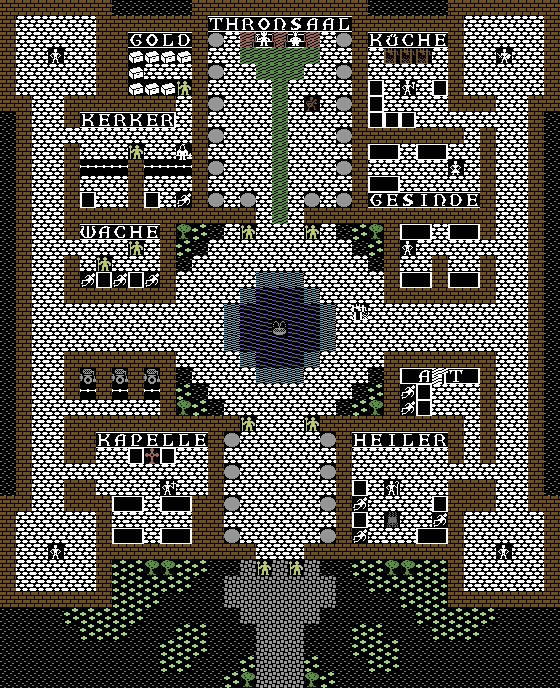
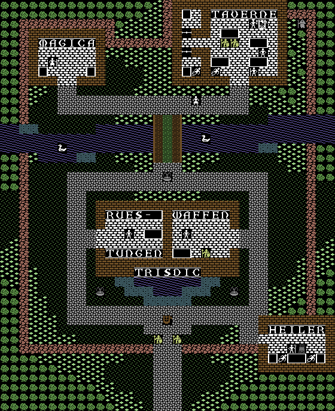
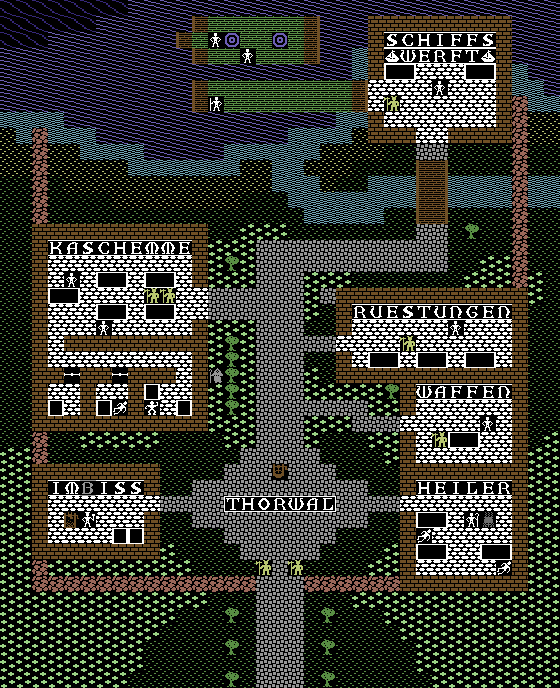
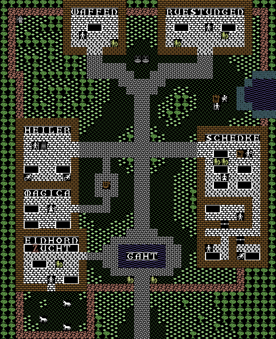
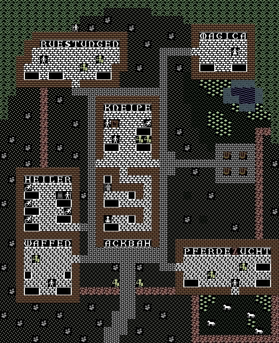
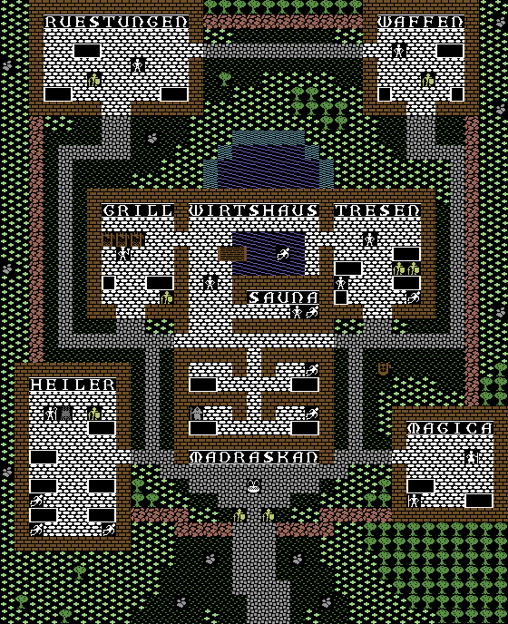
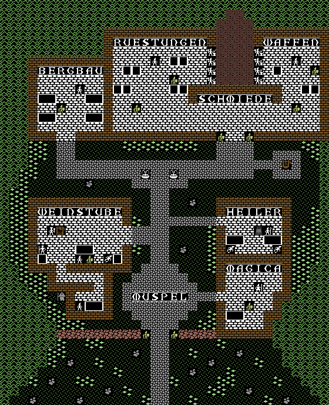
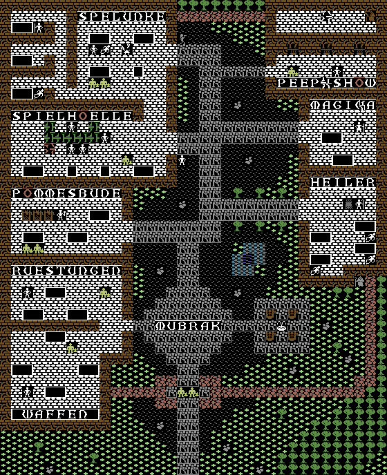
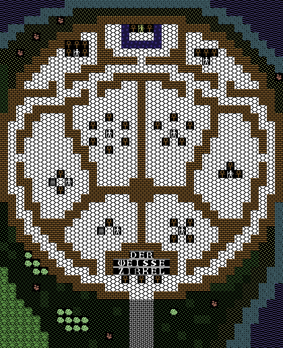
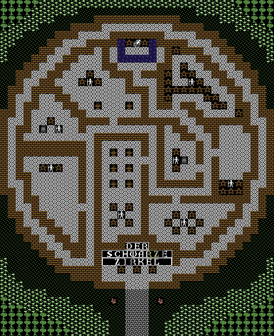
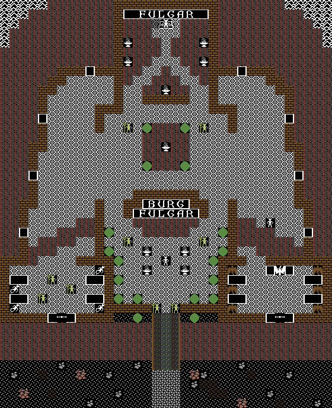
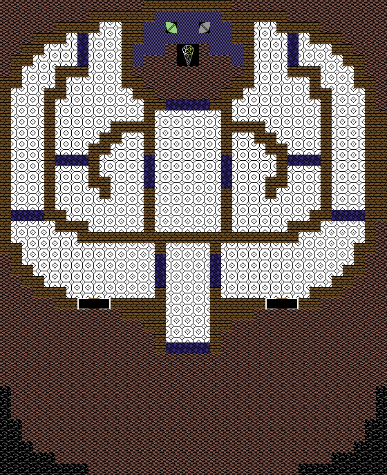


The druid cottage is 11 tiles wide.

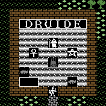

# Graphics

## Extracting palette data

Go to http://www.colodore.com/ and fine tune the palette. Click on the cog wheel
icon in the top right corner and select "PNG Format" to download the palette as
a png file. Use

```
make palette
```

to extract the color info.

## Charsets

```
make chars
```

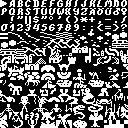
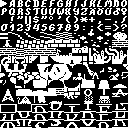
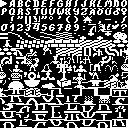
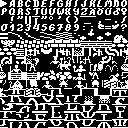
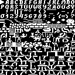
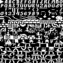
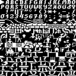
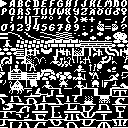
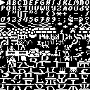
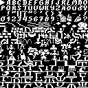
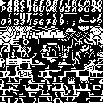
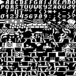
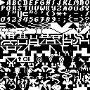
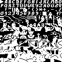
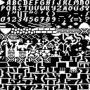
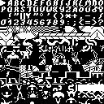
